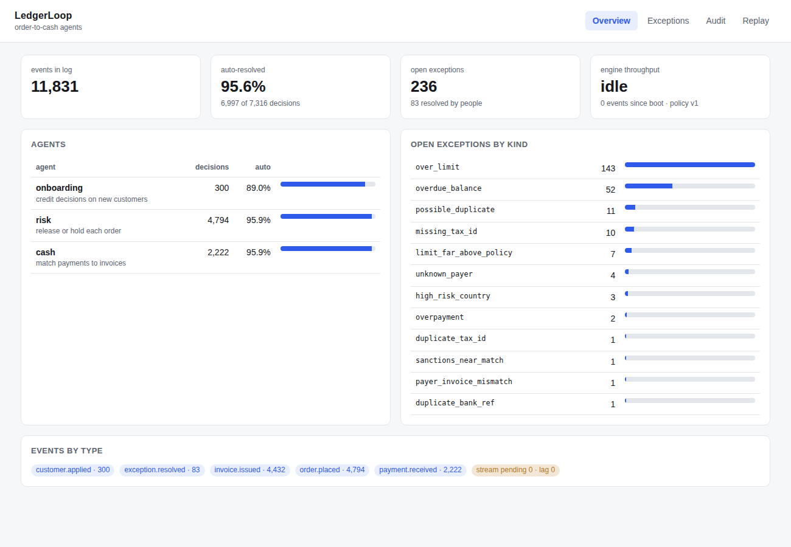
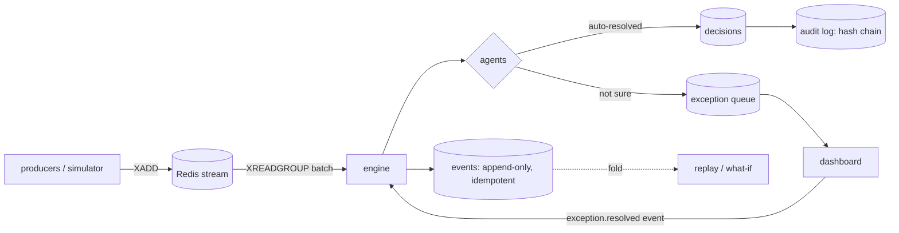

# LedgerLoop

Order-to-cash automation with three agents running over an append-only event log:

- **onboarding** decides whether a new customer gets credit, and how much
- **risk** releases or holds each order against the customer's exposure
- **cash** matches incoming payments to open invoices, working from messy remittance memos

Every decision is written to a hash-chained audit log. Anything an agent isn't sure about goes to an exception queue for a person. The whole history can be replayed from the log to re-derive every decision bit-for-bit, or re-run under a different policy to see what would change before you ship it. Design reasoning is in [docs/design.md](docs/design.md).



## How it works



**The log is the source of truth.** Customers applying, orders, invoices, payments, and a person resolving an exception are all events. Agent decisions are derived from them. In-memory state is disposable and rebuilt on boot by folding the log.

**Idempotent ingestion.** Redis delivers at least once. The engine commits a whole batch (new events, decisions, exceptions, audit entries, tool recordings) in one Postgres transaction and only then acks. If it dies between commit and ack, the batch is redelivered and the log turns it into a no-op: an `event_id` is stored once, and the same id with different content is flagged as a conflict instead of applied.

**Agents are pure functions** of `(event, state, policy, tools)`. They can't read the clock (the event's `occurred_at` is the only time), use randomness, or mutate state. They return a decision plus a list of effects, and the engine applies those. Money is integer cents throughout.

**Nondeterministic calls are recorded.** Anything an agent can't compute itself goes through a tool wrapper that stores the output next to the event. The remittance parser is a regex by default. There's an optional LLM fallback for memos the regex can't read (`LEDGERLOOP_LLM_PARSER=1`), and because its answers are recorded, replay reuses them instead of asking the model again.

**Replay** re-derives every decision from the log and compares hashes with what was stored. A mismatch means something nondeterministic leaked into an agent or its behavior changed. **What-if** replays history under another policy version and diffs the outcomes.

**Audit chain.** Each entry's hash covers the previous entry's hash, so editing or deleting any row breaks every hash after it and `verify` says where.

### The agents

| agent | auto-resolves | sends to a person |
|---|---|---|
| onboarding | approve with a limit capped by revenue policy; reject exact sanctions hits | missing tax id, sanctions near-match, shared tax id, near-identical name in the same country, limit far above policy |
| risk | release when exposure (open AR + released-but-uninvoiced orders) fits the limit, or is within 5% with nothing overdue | over limit, anything over 30 days past due, customer not approved |
| cash | exact ref match, short-pay within $50 (bank fees, written off), partial on a single ref when the payer's name agrees, no-memo match to one invoice or a unique set of invoices | unknown payer, ambiguous matches, overpayments, refs to paid invoices, the same bank transfer arriving twice |

The cash agent repairs typo'd invoice numbers, but only when the amount backs up the repair. Invoice numbers are sequential, so a one-digit typo usually lands on a real invoice, often someone else's. Ties are never broken by guessing: a wrong auto-match costs more than a manual one.

## Results

There's no real customer data here, so the benchmark runs on a synthetic stream from `ledgerloop/simulator.py`. It models a B2B business: customers apply, order against their credit, get invoiced, and pay late, short, in bundles, with typos, through bank feeds that truncate their names. It also returns ground truth, so we can count auto-decisions that were **wrong**, not just how many were made. An AR clerk (also simulated) works the cash exception queue 1-3 days behind.

Full pipeline (Redis stream → engine → Postgres), one consumer, batches of 500, on a 2-vCPU Linux container with Postgres 16 and Redis 7:

| run | events delivered | throughput | auto-resolved | wrong auto-decisions | replay |
|---|---|---|---|---|---|
| 1,000 customers, 120 days | 55,571 | ~4,000 events/s | 94.7% (32,763 of 34,610) | 3 | 35,215 decisions re-derived, 0 mismatches |
| 2,000 customers, 180 days | 169,879 | ~3,500 events/s | 92.9% (100,066 of 107,715) | 6 | 110,174 decisions re-derived, 0 mismatches |

Throughput moves about 10% between runs on the same machine. Raw results are in [`backend/bench_results/`](backend/bench_results).

Take the auto-resolution number with salt. It depends almost entirely on the scenario mix, and those rates are my guesses, not measurements from a real AR team. The precision number is more meaningful: at this mix, the agents are right when they act on their own.

### What the simulator caught

Most of the cash agent's logic came from running this and looking at the failures:

- **Truncated payer names.** Bank feeds cut names at a fixed width. Plain edit similarity matched `DRIFTWOOD ENERGY S` to *Driftwood Energy* instead of *Driftwood Energy Solutions*, which then looked like someone paying another company's invoice. Fixed with prefix-aware scoring.
- **Typos land on real invoices.** With sequential invoice numbers, transposing two digits usually produces another customer's invoice. Partial payments were being applied to the wrong one. Repairs now need the amount to corroborate them, and partials need the payer's name to agree with the invoice owner.
- **Stuck cash cascades into credit holds.** One payment stuck in review leaves an invoice open, the customer goes 30+ days overdue, and every later order gets held. Without anyone working the cash queue, one stuck payment caused about two held orders.
- **Generation order isn't time order.** Early on, some duplicate applications were dated before the company they duplicated, so the real customer got flagged and all its orders held.
- **Hot path.** Profiling showed ~35% of engine time in difflib comparing payer names that repeat constantly. Caching lookups per name block, then making the cache incremental (keep the top two candidates, only score customers added since), took the 55k-event run from ~2,800 to ~4,000 events/s without changing a single decision.

## Running it

Needs Python 3.11+, Postgres, Redis, Node 20.

```bash
# backend
cd backend
pip install -e ".[dev]"
pytest -q                                         # SQLite by default
LEDGERLOOP_TEST_DATABASE_URL=postgresql+psycopg://postgres@localhost/ledgerloop pytest -q

# API + stream consumer
export LEDGERLOOP_DATABASE_URL=postgresql+psycopg://postgres@localhost/ledgerloop
export LEDGERLOOP_CONSUME=1
uvicorn ledgerloop.api.main:app --port 8000

# feed it a simulated stream
python scripts/seed.py --to redis --customers 300 --days 90

# dashboard
cd ../web && npm install && npm run dev           # http://localhost:5173

# benchmark
cd ../backend && python scripts/bench.py --customers 1000 --days 120
```

Or `docker compose up --build`, then `docker compose exec api python scripts/seed.py --to redis`.

### API

| | |
|---|---|
| `POST /events` | ingest a batch directly (same path as the stream) |
| `GET /metrics` | counts, auto-resolution by agent, open exceptions, engine throughput |
| `GET /exceptions`, `GET /exceptions/{id}` | the queue, with what the agent saw and the subject's current state |
| `POST /exceptions/{id}/resolve` | approve/reject, release, apply cash by hand, put on account, refund |
| `GET /audit`, `GET /audit/verify` | recent entries, full chain check |
| `POST /replay/verify` | re-derive every decision and compare |
| `POST /replay/what-if` | diff history under another policy (`v2-strict` ships as an example) |

## Layout

```
backend/
  ledgerloop/
    events.py        event model, canonical JSON, deterministic ids
    eventlog.py      idempotent append, ordered reads
    state.py         in-memory projections, changed only through effects
    agents/          onboarding.py, risk.py, cash.py
    resolutions.py   human resolutions as events
    processor.py     one code path shared by live processing and replay
    engine.py        batch processing, single-transaction commit
    bus.py           Redis Streams consumer, ack after commit, dead letters
    replay.py        fold, verify, what-if
    audit.py         hash chain
    tools/           record/replay wrapper, regex + optional LLM memo parser
    simulator.py     synthetic workload with ground truth and a simulated clerk
    evaluate.py      scores a run against ground truth
    api/             FastAPI
  scripts/           bench.py, seed.py
  tests/
web/                 React + TypeScript dashboard
```

## Not production-ready

This is a project, not a product. Things a real deployment would need:

- **One consumer.** State lives in one process, so there's no horizontal scaling. Partitioning the stream by customer would be the next step.
- **Boot replays the whole log.** Fine at 170k events (~13s), not at 100M. Needs periodic snapshots.
- **No auth** on the API or the dashboard.
- **The audit chain is tamper-evident, not tamper-proof.** Someone with write access could rewrite the whole chain. Anchoring the head hash somewhere external would fix that.
- **The sanctions list is six made-up names.**
- **The scenario rates in the simulator are guesses.** The next step would be calibrating them against real remittance data.
- **Human resolutions aren't reviewed.** There's no four-eyes check on manual cash application or credit approvals.
